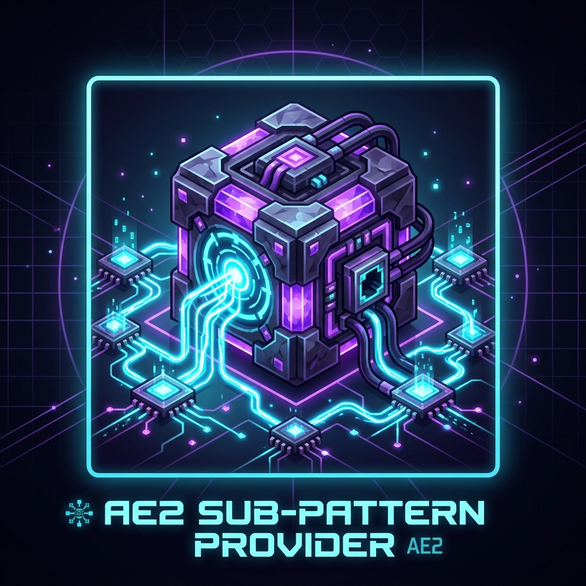

# AE2 Sub-Pattern Provider

<p align="center">
  
</p>

<p align="center">
  <strong>Scale your autocrafting across massive machine arrays without channel limits, pattern duplication, or TPS lag!</strong>
</p>

<p align="center">
  <a href="https://github.com/GeneraBlack/AE2Subnet/releases"></a>
  
  
  
</p>

---

## 💡 The Problem
In large modpacks (featuring GregTech, Modern Industrialization, Mekanism, or massive rows of Inscribers and Furnaces), you often need **10, 20, or even 50 identical machines** to process a single recipe at high speed.

In standard AE2, this causes major bottlenecks:
- ❌ **Pattern Duplication**: Manually crafting and encoding dozens of identical patterns.
- ❌ **Channel Waste**: Every single pattern provider consumes a precious channel on your main ME network.
- ❌ **Complex Subnets**: Storage bus subnets with interfaces require complicated filtering and can cause item-spill or stalling.

---

## ⚡ The Solution
**AE2 Sub-Pattern Provider** introduces a high-performance **1-to-many pattern distribution system** powered by a dedicated ME subnet and an $O(1)$ event-driven worker queue.

Encode your processing pattern **once** into the **Master Pattern Provider**. The mod automatically discovers all connected **Sub-Pattern Providers** on its subnet and dispatches crafting jobs to whatever machines are idle—distributing the workload evenly and running all machines at maximum throughput!

```
[ME Crafting CPU]
       │ (pushed craft)
       ▼
[Master Pattern Provider]  ─── 1 Channel on Main Network
       │
       │ (Dedicated ME Subnet - 0 Main Channels!)
       ├───► [Sub-Provider #1] ──► Machine #1 (Furnace / Assembler / Inscriber)
       ├───► [Sub-Provider #2] ──► Machine #2 (Furnace / Assembler / Inscriber)
       ├───► [Sub-Provider #3] ──► Machine #3 (Furnace / Assembler / Inscriber)
       └───► [Sub-Provider #N] ──► Machine #N ... (Infinite parallel scaling!)
```

---

## ✨ Features

- 🚀 **1-to-Many Pattern Distribution**: 16 processing pattern slots in the Master Provider distribute across infinite connected sub-providers.
- ⚡ **Zero Main Network Channel Waste**: The Master Provider consumes only **1 channel** on your main network. The entire worker subnet uses **0 main channels**.
- ⚡ **Zero-Latency Power Bridging**: Automatic energy bridging via AE2's canonical Energy Overlay Grid. No quartz fibers or batteries needed.
- ⏱️ **$O(1)$ Event-Driven Queue**: Zero TPS impact! Workers register themselves into an instant queue without polling loops.
- 🔄 **Smart Placement & Directional Fallback**:
  - Automatically faces adjacent machines on placement.
  - Directional fallback insertion resolves strict-sided inventories (e.g. vanilla furnaces).
  - Automatically intercepts craft outputs and returns them to main network storage.
  - Active auto-pull fallback for non-ejecting machines.
- 📊 **Live Telemetry HUD**: Monitor subnet health, channel availability, power status, and real-time worker counters directly in the Master GUI.
- 🎨 **Authentic AE2 Aesthetics**: Animated Fluix conduits, glowing cyan subnet port, and responsive status indicator LEDs.

---

## 📖 Quick Start Guide

1. Place the **Master Pattern Provider** connected to your main ME network.
2. Run an ME Cable from the **cyan subnet port** on the Master Provider to your machine line.  
   *(Tip: Use an AE2 Wrench to rotate the cyan port if needed).*
3. Place a **Sub-Pattern Provider** against each machine and connect each to the subnet cable.
4. Insert your processing patterns into the Master Pattern Provider.
5. Request a craft from your ME Terminal—all idle machines will craft simultaneously!

---

## 📜 License
This project is licensed under the [MIT License](LICENSE). Modpack creators are free to include this mod in any public or private pack.
